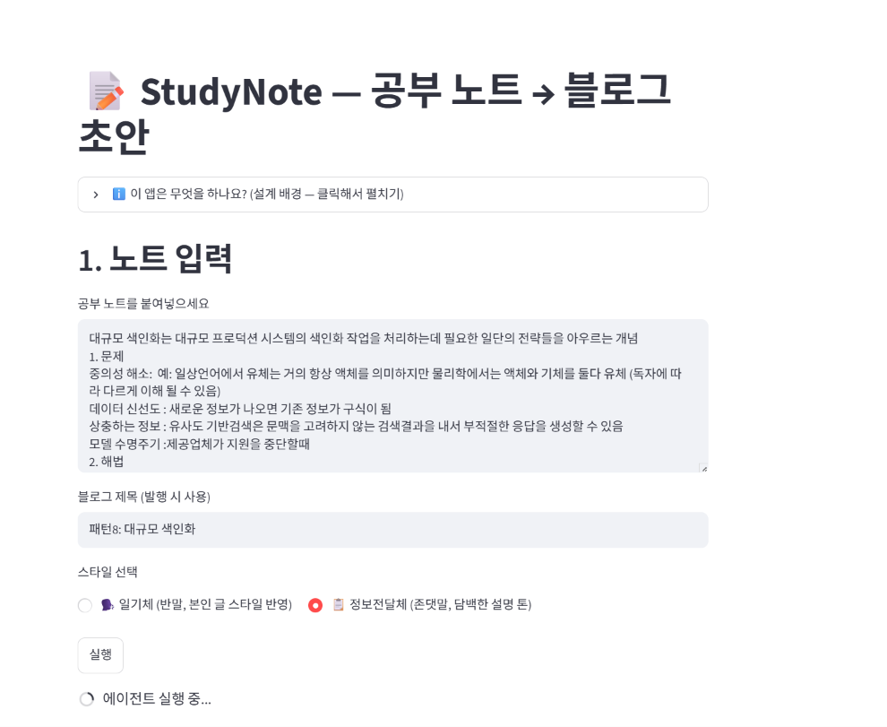
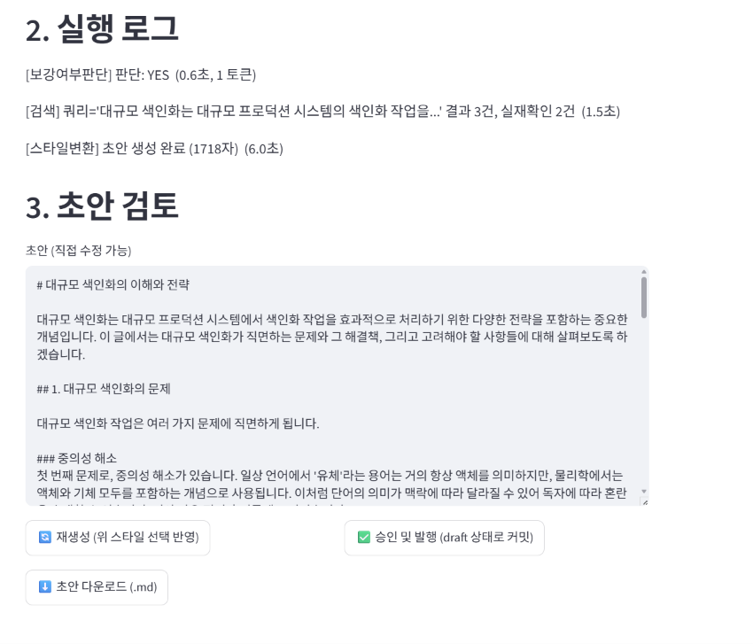
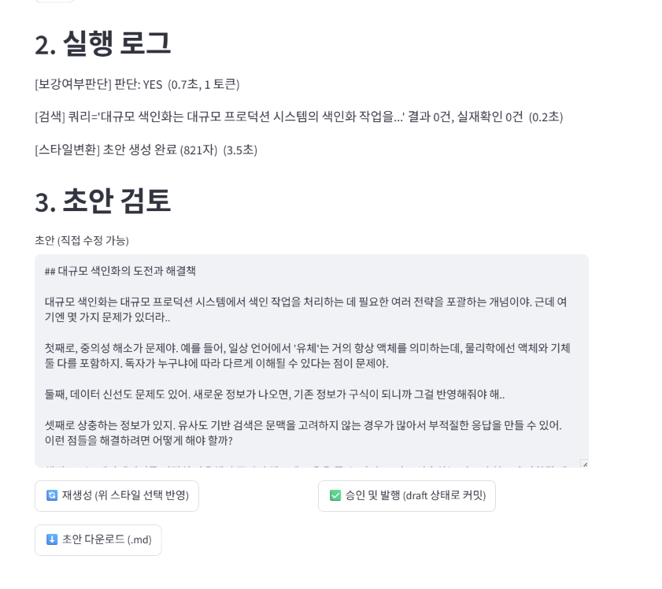

# StudyNote

공부 노트(텍스트/사진)를 본인 문체가 반영된 블로그 초안으로 바꿔주는 에이전틱 워크플로.

- **배포**: https://studynote-gjabtlknzqu7ppcuxqx3he.streamlit.app
- **기획 문서**: [PRD.md](PRD.md)
- **평가**: [eval/](eval/)

## 실행 화면

**1. 노트 입력 + 스타일 선택**


**2-A. 정보전달체(존댓말) 모드 결과** — 검색 3건 중 실재확인 2건 반영


**2-B. 일기체(반말) 모드 결과** — 같은 노트, 스타일만 바꿔 재생성


같은 노트를 두 스타일로 각각 실행해 비교한 예시. 검색 결과 건수가 두 캡처에서 다른 것은
(3건/0건) DuckDuckGo 무료 검색이 짧은 시간 안에 반복 호출되면 속도제한에 걸려 빈 결과를
반환하는 경우가 있기 때문으로 보인다 — "알려진 제한"에 이미 적어둔 그 한계가 실제로
관찰된 사례.

## 워크플로

```
노트 입력 → 보강여부판단(에이전트) → 검색/실재성확인(도구) → 스타일변환(도구+LLM)
   → [사람 승인] → 발행(도구, draft 상태로 GitHub 커밋)
```

## 실행 방법

```bash
pip install -r requirements.txt
cp .env.example .env   # 키 채우기
streamlit run app.py
```

**필요한 것**
- `OPENAI_API_KEY` — 스타일 변환에 사용 (`sk-proj-...` 형식)
- `GITHUB_TOKEN` + `GITHUB_BLOG_REPO` — 발행 도구용 (선택. 없으면 발행 시 로컬 파일로 저장됨)

## 도구

| 도구 | 파일 | 역할 |
| --- | --- | --- |
| 검색/RAG | `agent/tools/search_tool.py` | DuckDuckGo 검색 + URL 실재성 확인(citecheck 원칙 재사용) |
| 스타일 변환 | `agent/tools/style_tool.py` | `data/style_examples/*.txt`를 few-shot으로 활용한 문체 재작성 |
| 발행 | `agent/tools/publish_tool.py` | GitHub API로 draft 상태 커밋, 실패 시 로컬 저장 |

## 사람 개입 지점

발행 전 초안 검토·수정·재생성 — Streamlit 앱 화면3에서 승인 버튼을 눌러야만 발행이 실행됨.
승인 없이 발행되는 경로는 없음.

## 알려진 제한

- MVP 단계 — 검색은 DuckDuckGo 무료 검색만 사용(정교한 RAG 랭킹 없음)
- 스타일 예시가 비어 있으면(`data/style_examples/`) 기본 톤으로만 작성됨
- 이미지 노트 입력(OCR)은 아직 미구현 — 텍스트 입력만 지원